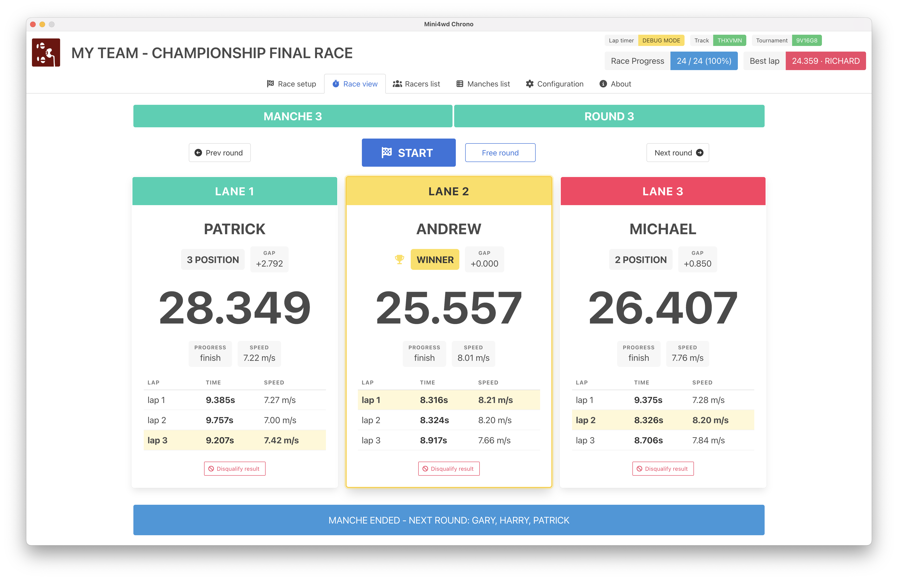
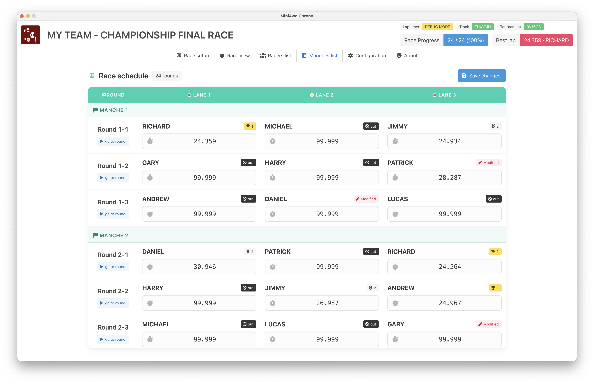
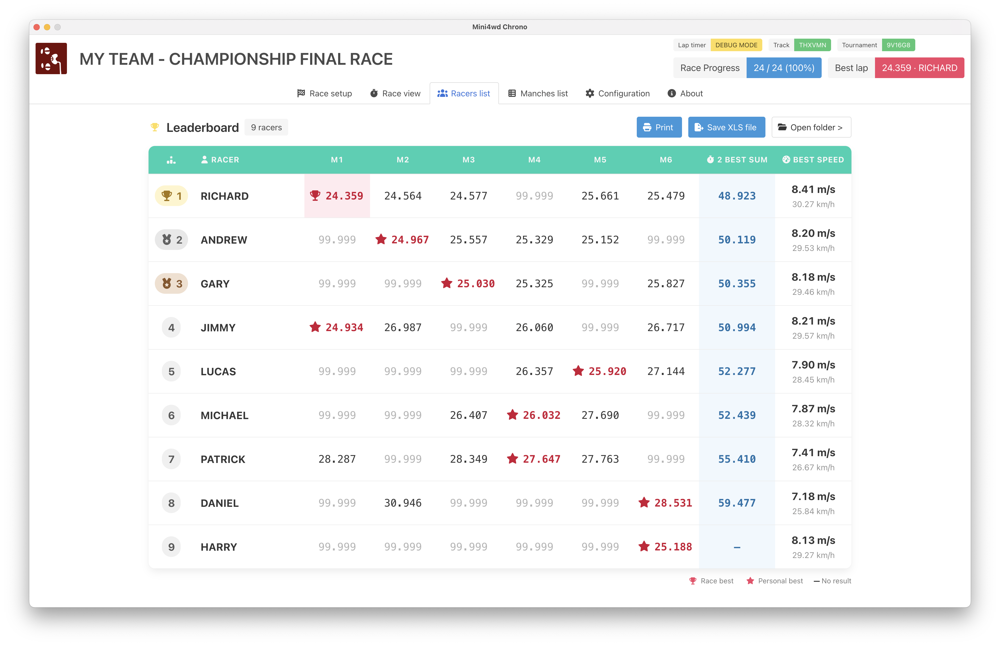
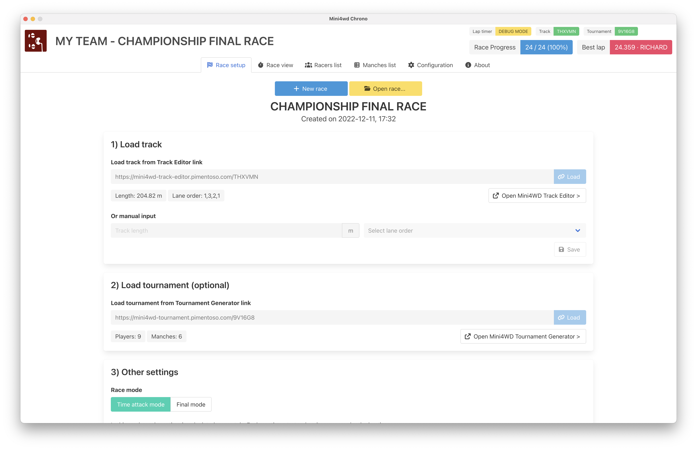

# Mini4wdChrono

[](https://github.com/Pimentoso/mini4wdchrono/releases)
[](LICENSE)

Mini4wdChrono is a free, open-source desktop application for timing and managing
Mini 4WD races on three-lane Japan Cup tracks. It combines Arduino-based lap
detection with an interface designed for race organizers and large-screen displays.

## Features

- Live timing for up to three lanes, including position, gaps, average speed, and split times
- Configurable lap counts, timing thresholds, start sequence, sensors, LEDs, and buzzer
- Track import from [Mini4WD Track Editor](https://mini4wd-track-editor.pimentoso.com/)
- Player and round import from [Mini4WD Tournament Generator](https://mini4wd-tournament.pimentoso.com/)
- Tournament standings, editable results, and free-race support
- Persistent race data and Excel result exports

## Hardware

The hardware is designed to be affordable and straightforward to assemble while
maintaining accurate timing. An Arduino running Firmata connects the sensors and
optional start button, LED strip, and buzzer to the application.

See the project wiki for complete assembly and setup instructions:

- [Required hardware](https://github.com/Pimentoso/mini4wdchrono/wiki/Hardware-parts-needed)
- [Wiring diagrams](https://github.com/Pimentoso/mini4wdchrono/wiki/Hardware-diagrams)
- [Flashing the Arduino](https://github.com/Pimentoso/mini4wdchrono/wiki/Flashing-the-arduino-board)
- [Building the lap timer](https://github.com/Pimentoso/mini4wdchrono/wiki/Lap-timer-building)
- [Launching the software](https://github.com/Pimentoso/mini4wdchrono/wiki/Launching-the-software)

## Download

Download a packaged build for your operating system from the
[GitHub Releases page](https://github.com/Pimentoso/mini4wdchrono/releases).
Available platforms may vary by release.

## Getting started

1. Build and flash the Arduino hardware by following the
   [hardware guides](https://github.com/Pimentoso/mini4wdchrono/wiki).
2. Connect the Arduino to your computer over USB.
3. Launch Mini4wdChrono and open the **Configuration** tab.
4. Select the serial port and configure the sensor pins and any optional hardware.
5. Create a track with
   [Mini4WD Track Editor](https://mini4wd-track-editor.pimentoso.com/) and load its
   link in the race setup screen.
6. For tournament races, create a player list and rounds with
   [Mini4WD Tournament Generator](https://mini4wd-tournament.pimentoso.com/) and
   load its link as well.

For more detail, see the
[software quick-start guide](https://github.com/Pimentoso/mini4wdchrono/wiki/Software-quick-start-guide)
and [tournament rules](https://github.com/Pimentoso/mini4wdchrono/wiki/Software-tournament-rules).

## Screenshots

### Live race view

Position, gap to the leader, average speed, and split times.



### Player standings

Player rankings with each racer's best time highlighted.



### Tournament rounds

An overview of every round with editable results.



### Race setup

Track, tournament, timing, and race-mode configuration.



## Development

Mini4wdChrono requires Node.js 22.13.0 and npm 9 or later. Node.js is managed
with [asdf](https://asdf-vm.com/); install asdf and its Node.js plugin, then
run the following from the repository root to install the pinned version:

```bash
asdf plugin add nodejs
asdf install
```

Use the setup instructions for your operating system before installing the
project.

### Set up macOS

Install the Xcode Command Line Tools, then install
[Homebrew](https://brew.sh/) if it is not already available:

```bash
xcode-select --install
```

After the Command Line Tools installation completes, use Homebrew to install
Git and the Arduino IDE:

```bash
brew install git
brew install --cask arduino-ide
```

### Set up Windows

Run the following commands from an elevated PowerShell window. They install Git,
Python, the Visual C++ build tools required by native dependencies, and the
Arduino IDE:

```powershell
winget install --id Git.Git --exact --accept-package-agreements --accept-source-agreements
winget install --id Python.Python.3.11 --exact --accept-package-agreements --accept-source-agreements
winget install --id Microsoft.VisualStudio.2022.BuildTools --exact `
  --accept-package-agreements --accept-source-agreements `
  --override "--wait --passive --add Microsoft.VisualStudio.Workload.VCTools --includeRecommended"
winget install --id ArduinoSA.IDE.stable --exact --accept-package-agreements --accept-source-agreements
```

Close and reopen PowerShell after the installations finish so the new commands
are available on `PATH`.

### Set up Linux

The following commands prepare an Ubuntu or Debian system. They install the
compiler toolchain, Git, and zip:

```bash
sudo apt update
sudo apt install -y build-essential ca-certificates curl git zip
sudo usermod -aG dialout "$USER"
```

Sign out and back in after adding your account to the `dialout` group. This
allows Mini4wdChrono to access the Arduino serial port without making the device
world-writable. Install the [Arduino IDE](https://www.arduino.cc/en/software)
from Arduino's official download if you need to flash the board.

For other Linux distributions, install equivalent packages with the system's
package manager.

### Install and run Mini4wdChrono

After preparing the operating system, clone the repository, install the locked
dependencies, and start Electron:

```bash
git clone https://github.com/Pimentoso/mini4wdchrono.git
cd mini4wdchrono
npm ci
npm start
```

Connect a Firmata-compatible Arduino over USB to test hardware integration.
Use `npm run watch` to reload the application while developing. Run the linter
before submitting changes:

```bash
npm run lint:fix
npm run lint
```

### Project structure

- `window.js` — Electron main process, persistence, serial hardware, and IPC
- `preload.js` — restricted renderer-facing IPC API
- `js/` — renderer UI and race-management logic
- `index.html` — application markup
- `utils/` — release packaging scripts

## Building release artifacts

The build scripts install the locked dependencies, package the application, and
create a zip file in `release-builds/`.

| Platform | Command | Output |
| --- | --- | --- |
| macOS x64 | `./utils/build-darwin.sh` | `Mini4wdChrono-mac-x64.zip` |
| Linux x64 | `./utils/build-linux-x64.sh` | `Mini4wdChrono-linux-x64.zip` |
| Windows x64 | `.\utils\build-win64.ps1` | `Mini4wdChrono-windows-x64.zip` |

Run each script on its target operating system. Cross-platform packaging is not
supported by these scripts.

## Contributing

Bug reports and pull requests are welcome. Before opening a pull request:

1. Create a focused branch for the change.
2. Keep hardware access in the Electron main process and expose it to the
   renderer through IPC.
3. Run `npm run lint:fix` followed by `npm run lint`.
4. Describe the change, how it was tested, and any hardware used for testing.

Please use [GitHub Issues](https://github.com/Pimentoso/mini4wdchrono/issues) for bugs and feature requests.

## License

Mini4wdChrono is available under the [MIT License](LICENSE).
